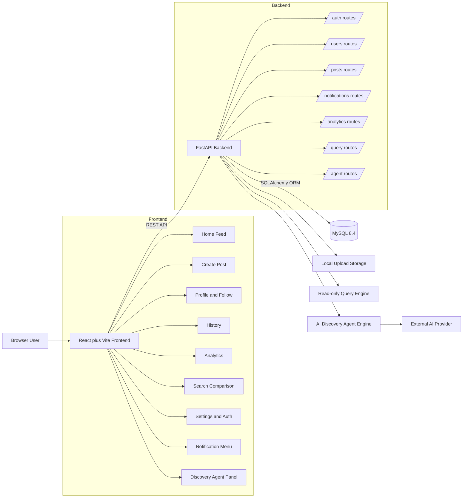
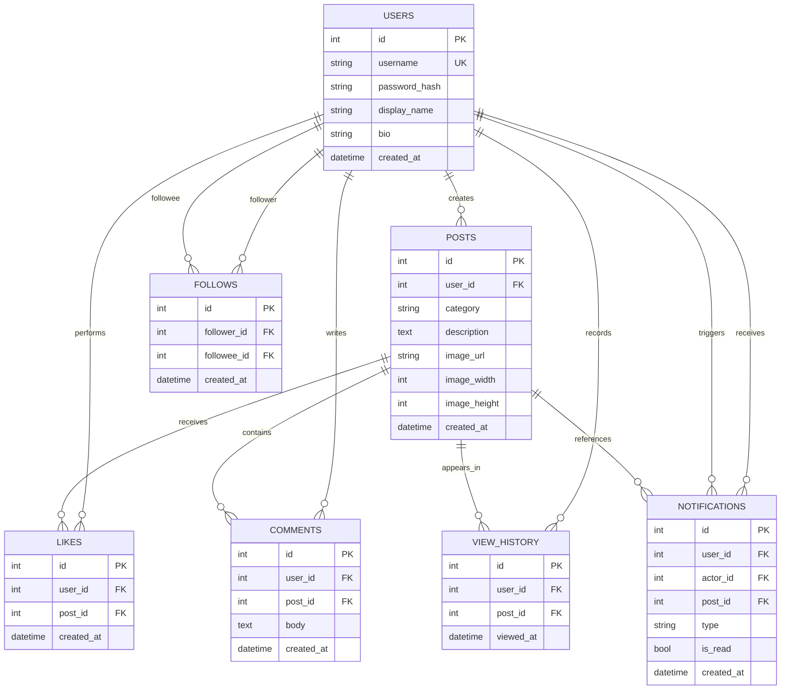
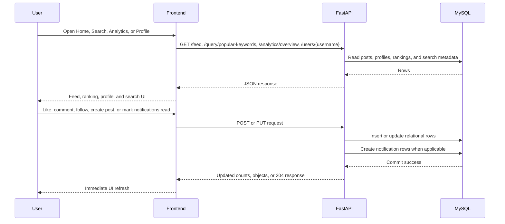
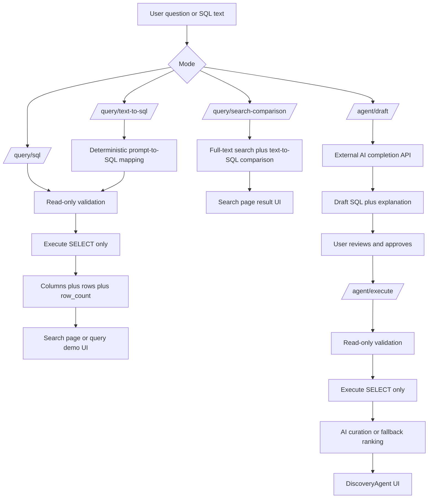

# HKUgram Project Diagrams

This file captures the diagrams that support the COMP3278 final presentation.
The diagrams below are aligned with the current implementation in `backend/app` and `frontend/src`.

## 1. System Architecture

## 2. ER Diagram

## 3. Main Social Data Flow

## 4. Query And Agent Flow

## Notes For Presentation

- The required relational design is covered by `users`, `posts`, `likes`, `comments`, `view_history`, `follows`, and `notifications`.
- The SQL system requirement is covered by the read-only `/query/sql` endpoint, deterministic `/query/text-to-sql`, and the approval-based `/agent` workflow.
- The UI scope now includes feed, posting, profile/follow, history, analytics, search, notifications, and the AI discovery panel.
- Upload storage remains local to the backend and is exposed through `/uploads`.
- Deployment is still handled separately by Docker Compose with frontend, backend, MySQL, and Adminer services.
